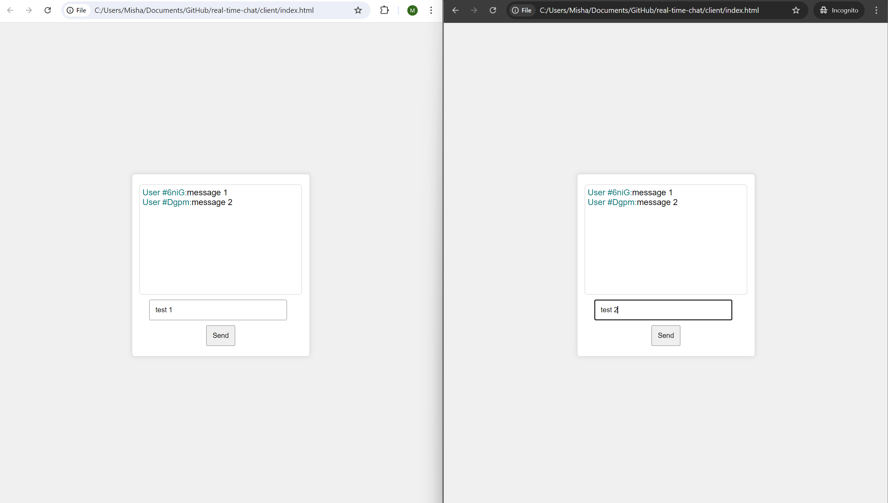
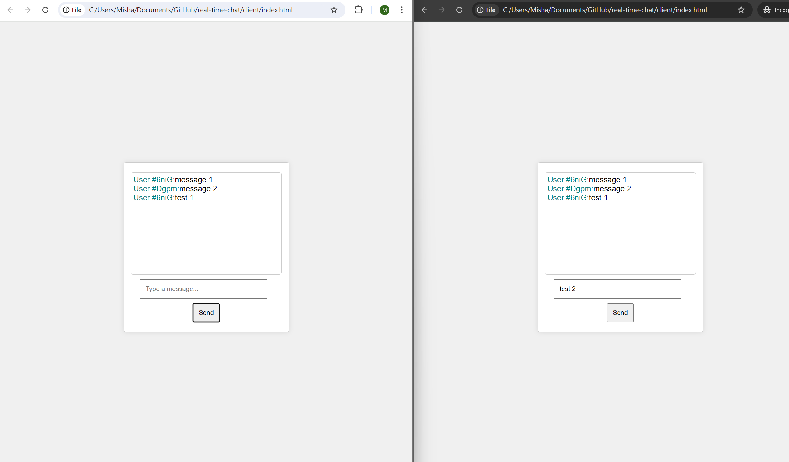
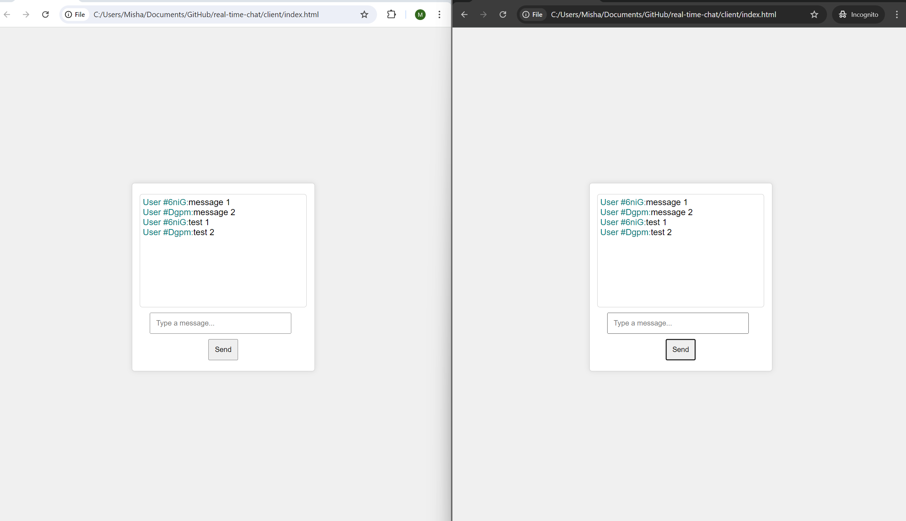
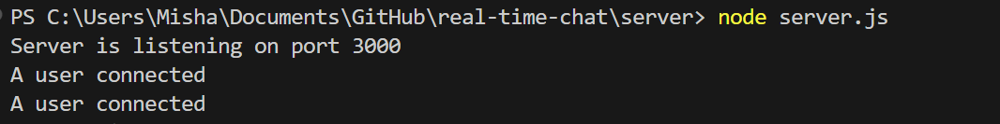

# Real-time Chat Application

## Project Overview

This project is about making a simple real-time chat app using Node.js and Socket.IO. The app lets users chat with each other in real-time, and it shows the first four characters of each user's ID with their messages.

## Implementation Details

### Server-side Implementation

1. **Server Setup**:
   - Used `express` to create a web server.
   - Used `socket.io` to handle real-time communication.
   - Set up CORS to allow connections from any origin for testing.

2. **Handling Connections**:
   - Gave each connected user a unique ID (using `socket.id`).
   - Sent the user ID to the client when they connected.
   - Listened for messages from clients and sent those messages to everyone.

